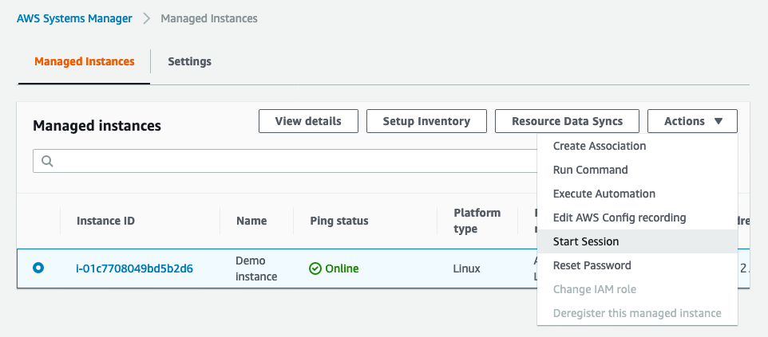

# Transit Gateway Demo Stack: Egress-VPC Design Pattern

> This CDK project demonstrates a shared egress-VPC design pattern. Furthermore, the stack uses AWS Systems Manager Session Manager to securely access a demo EC2 instance in a private VPC / subnet.

## Solution Overview

The architecture diagram that follows shows the egress VPC pattern and elements created by the template. The private VPC contains a single EC2 instance. It lacks a direct route to the internet and has no public subnets or internet gateway. Instead, traffic destined for the internet is routed to the Transit Gateway.

The second VPC contains two pairs of public and private subnets, an internet gateway and two NAT gateways. Both VPCs are attached to the Transit Gateway, which allows north-south connectivity. All relevant routes are depicted in tables connected by dotted lines.

## Walkthrough

In this section you will familiarize yourself with using [AWS Cloud Development Kit](https://docs.aws.amazon.com/cdk/latest/guide/home.html) (CDK) by downloading and deploying an egress VPC demo into your AWS account.

This will include:

- Installing CDK and closing this [demo repository](https://github.com/aws-samples/aws-transit-gateway-egress-vpc-pattern)
- Deploying the example environment into your AWS account
- Familiarizing yourself with the egress VPC pattern and the associated constructs and routing
- Securely accessing the shell of a fully private EC2 instance via [AWS Systems Manager Session Manager](https://docs.aws.amazon.com/systems-manager/latest/userguide/session-manager.html)

### Prerequisites

- An [AWS account](https://signin.aws.amazon.com/signin?redirect_uri=https%3A%2F%2Fportal.aws.amazon.com%2Fbilling%2Fsignup%2Fresume&client_id=signup)
- Installed and authenticated [AWS CLI](https://docs.aws.amazon.com/en_pv/cli/latest/userguide/cli-chap-install.html) (authenticate with an [IAM](https://docs.aws.amazon.com/IAM/latest/UserGuide/getting-started.html) user or an [AWS STS](https://docs.aws.amazon.com/STS/latest/APIReference/Welcome.html) Security Token)
- AWS [CDK](https://docs.aws.amazon.com/cdk/latest/guide/getting_started.html) installed (typically via `npm install aws-cdk -g`)

### Let’s get you started

1. Make sure that you completed the prerequisite above and git pulled the CDK example by running the following command in a local directory: `git clone git@github.com:aws-samples/aws-transit-gateway-egress-vpc-pattern.git`

2. Open the repository in your preferred local editor and inspect lib/egress_vpc-tg-demo-stack.ts

3. Run `npm install` to include dependencies

4. Run `npm run build` once or keep a separate terminal window open running `npm run watch` to start compilation to JavaScript in watch mode

5. Run `cdk synth` and check out the synthesized [AWS CloudFormation](https://docs.aws.amazon.com/AWSCloudFormation/latest/UserGuide/Welcome.html) YAML syntax that will be used for deployment of the stack. Due to the higher-level programming languages used in CDK and the use of constructor libraries the CDK code is significantly more compact and more powerful than conventional markup.

6. Now you can deploy the stack simply by running `cdk deploy` and observe the progress in your terminal window

7. Once stack creation is complete open the AWS Console, select the AWS Systems Manager, choose the automatically listed instance we created with the stack and click on “Start Session”

8. Execute any command to test internet connectivity, for instance a nice and simple `ping amazon.com`

## Good to know and explore

- The image to create the EC2 instance is selected based on a higher level constructor [AmazonLinuxImage](https://docs.aws.amazon.com/cdk/api/latest/docs/@aws-cdk_aws-ec2.AmazonLinuxImage.html) and the AMI ID is automatically retrieved via the SSM parameter store. This means that the stack can be deployed to multiple regions and will automatically retrieve the latest managed image of the selected OS. By default CDK will use your default AWS cli configuration, however multiple environments can easily be [integrated](https://docs.aws.amazon.com/cdk/latest/guide/environments.html) via CDK native functionality.

- AWS Systems Manager Agent (SSM Agent) is included in the utilized AMI and requires two managed policies to work, which are attached to the instance’s role.

- The CDK template includes commented out examples of adding [VPC Endpoint for Systems Manager](https://docs.aws.amazon.com/systems-manager/latest/userguide/setup-create-vpc.html) and illustrates the use of mandatory, as well as optional endpoints.

## Useful CDK commands

- `npm run build`   compile typescript to js
- `npm run watch`   watch for changes and compile
- `cdk deploy`      deploy this stack to your default AWS account/region
- `cdk diff`        compare deployed stack with current state
- `cdk synth`       emits the synthesized CloudFormation template

## Cleaning up

To avoid incurring future charges, delete the resources by simply running `cdk destroy` and confirm deletion.

## License

This library is licensed under the MIT-0 License. See the LICENSE file.
